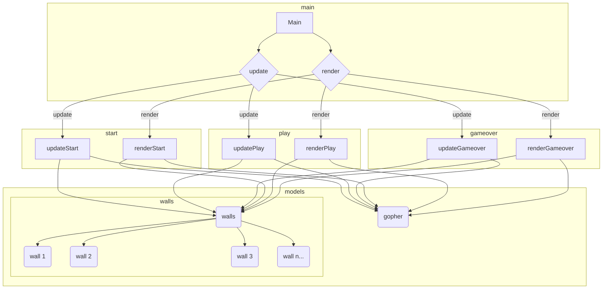

# Flappy Gopher

[Firefly Zero](https://fireflyzero.com/) version of the Flappy Gopher game.

Reinterpreted from the implementation here:

https://github.com/sago35/koebiten/tree/main/games/flappygopher

## Code architecture

## How the game functions

The main program has 2 important functions.

The `update()` function is used to manage the state of the game. It controls the game rules and behavior. This function will be called many times per second. This is where the program checks to see if the player has pressed any buttons, and controls the logic about if the player has been hit by a wall, the score of the game, etc.

The `render()` function is called to display the game graphics. It controls how things look on the screen, such as drawing the graphics for the  gopher and the walls. The function is called only when the screen needs to be refreshed, which is less often than the `update()` function that controls the game play.

## Game modes

The game has three different modes:

- `start` - before a new game has started
- `play` - while the game is being played
- `gameover` - after the game has ended

As such, there is an `updateStart()` function and a `renderStart()` function for the `start` mode.

Likewise, there is a `updatePlay()` function and a `renderPlay()` function for the `play` mode.

And of course an `updateGameover()` function and a `renderGameover()` function for the `gameover` mode

## Game models

The game has 2 different things that are involved with the game play. One is the `gopher` that the player is controlling. There is a `gopher` type that represents the player.

The other are the `walls` that the player is trying to have the `gopher` avoid crashing into. There is a `walls` type for managing all of the walls, and then a separate `wall` type for each individual wall.

## Architecture diagram

This diagram shows the relationship between the different game functions, game modes, and the game models.

